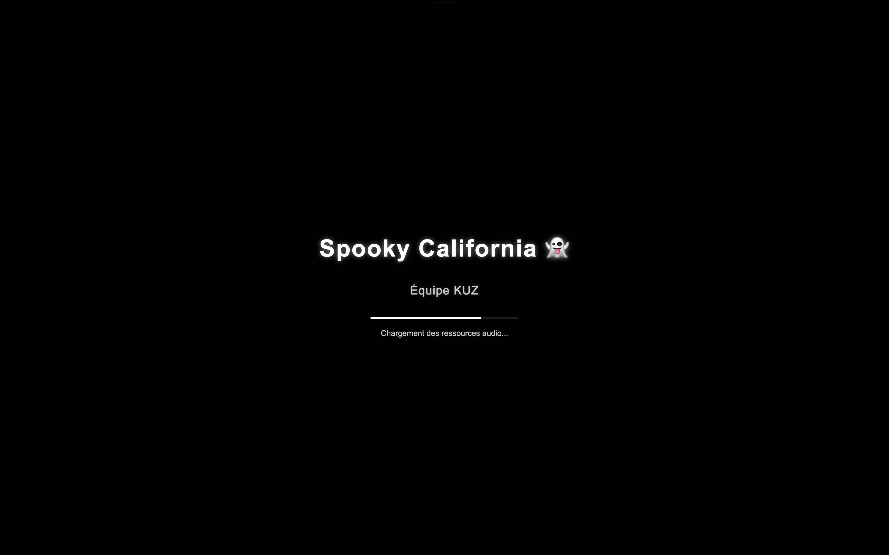

# KUZ - 24H DU CODE 2025 : Sujet Le Mans School Of AI
Vainqueur 2025 - 1er prix étuditant du sujet proposé par Le Mans School Of AI

## Les développeurs

- **Ugo ROSERAT** : Il s'est occupé de développer l'IHM et l'API de speech-to-text / text-to-speech.
- **Zakaria SALMI** : Il s'est occupé, avec Kévin ALVES, du développement des différents agents IA. (PS : Il est en recherche d'alternance, n'hésitez pas à le contacter.)
- **Kévin ALVES** : Il s'est occupé, avec Zakaria SALMI, du développement des différents agents IA. (PS : Faut vraiment donner une alternance à Zak)

## Les stats fun
- **5720** lignes de codes
- **6** cafés et **3** redbull
- **0** heure de sommeil
- **24** heure de code

## Galerie Média

### Images

### Vidéo de démonstration
[Cliquez ici pour voir la vidéo de démonstration](https://www.youtube.com/watch?v=IAd7BZcSHbs)

## Description

Ce projet a été créé dans le cadre du hackathon "Les 24H du code 2025". Nous avons choisi le sujet proposé par Le Mans School of AI. L'objectif était de développer un assistant IA intelligent pour l'hôtel California du Mans, capable d'interagir avec les clients de manière naturelle et efficace.

### Contexte
Le dirigeant de l'hôtel California du Mans a confié la mission de mettre en œuvre un assistant IA pour améliorer l'expérience client. L'objectif principal est de proposer une solution complète et ergonomique qui s'adapte aux besoins des clients, qu'ils soient technophiles ou non.

### Objectifs
- Développer un assistant IA capable de gérer diverses fonctionnalités :
  - Réservation de restaurant
  - Informations sur l'hôtel
  - Informations météo et locales
  - Gestion des services spa
- Créer une interface utilisateur intuitive et accessible
- Assurer une expérience fluide en mode texte et vocal
- Intégrer une représentation visuelle de l'assistant
- Garantir une réactivité et une robustesse optimales

### Technologies Utilisées
- LLM Mistral pour le traitement du langage naturel
- API du système d'information de l'hôtel
- Framework LangChain pour la gestion des agents
- LangFuse pour le monitoring et le debugging
- Technologies web modernes pour l'interface utilisateur

## Architecture du Projet

Le projet est divisé en trois composants principaux :

### 1. AGENTS IA 🤖
Système multi-agents intelligent qui gère :
- Coordination des agents spécialisés
- Gestion des réservations
- Service client
- Informations météorologiques
- Actualités locales
- Services spa

### 2. API TTS WHISPER 🎙️
Service de traitement audio qui fournit :
- Conversion texte-parole (TTS)
- Transcription audio en texte
- Support multilingue

### 3. IHM 🎮
Interface utilisateur immersive avec :
- Environnement 3D de l'hôtel
- Réceptionniste virtuel animé
- Interactions vocales
- Design thématique "Spookie California"
